# 서버이관

## 개요

개발완료된 war 파일에 대해 WAS서버로의  **ftp 이관** , **WAS Deploy** 및 해당 **WAS 서버의 기동/중지**에 대해 설명한다.

## 설명

완성된 모듈(WAR)에 대한 서버로의 FTP, Deploy 및 WAS 기동/중지를 수행하기 위해서는 다음의 절차를 따라야 한다.

1. **관리자 로그인**
   WAS에 해당 모듈의 Deploy 및 WAS 기동/중지를 수행하여야 하므로 관리자 로그인이 선행되어야 한다.
   시스템 초기 배포시 admin/admin123으로 셋팅되어 있으며 로그인 후 비밀번호 변경으로 변경하여야 한다.
2. 서버 정보 등록
   프로젝트에서 관리할 서버 정보(IP)를 등록한다.
3. WAS 정보 등록
   프로젝트에서 사용하는 WAS 정보(WAS 종류, 기동/중지 스크립트)를 등록한다.
   현재 지원가능한 WAS는 Jeus, Weblogic, JBoss이다.
4. 배포작업 등록
   배포작업 정보(이관모듈, WAS정보, ftp경로, 디플로이 대상)를 등록한다.
5. WAS 기동 및 중지
   등록되어 있는 WAS 정보를 참조하여 WAS 서버의 기동 및 중지를 수행한다.
   WAS 정보 등록이 선행되어야 한다.
6. FTP 및 Deploy
   등록되어 있는 배포작업 정보를 참조하여 FTP 및 Deploy를 수행한다.
   배포작업 등록이 선행되어야 한다.

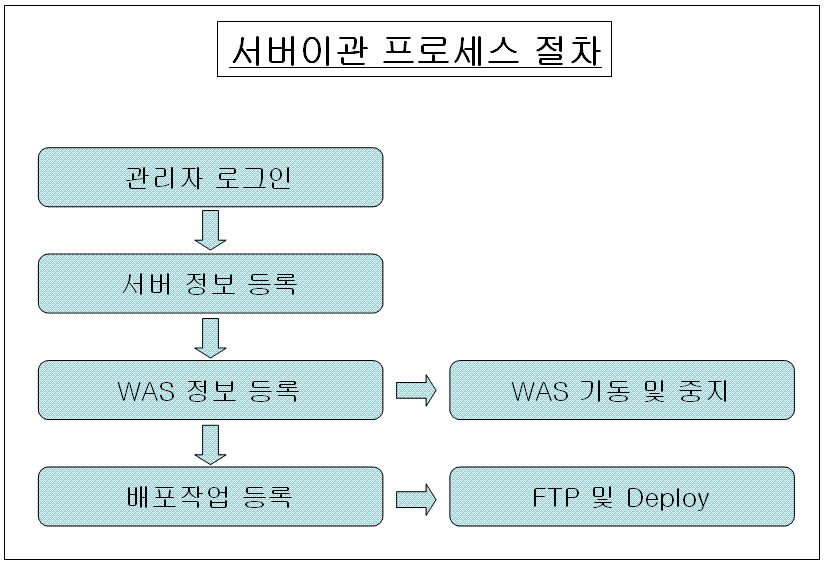

## 환경설정

1. Deployment Tool 설치
   전자정부 프레임워크 포탈([http://www.egovframe.go.kr](http://www.egovframe.go.kr/))을 통해 Deployment Tool을 내려받고 해당 WAS서버에 Deploy한다.
   Deploy 위치는 형상관리서버가 설치되어 있는 서버로 하여야 한다.(war 파일이 존재하는 서버)
2. WAS 환경변수 설정
   WAS 서버 구동시 환경변수(deploy.script.home, deploy.path)를 설정한다.

   –Ddeploy.script.home=“배포스크립트 및 로그파일이 저장될 디렉토리”
   –Ddeploy.path=“war 파일이 존재하는 루트 디렉토리”
3. 프로퍼티 파일 변경
   Deployment Tool을 해당 WAS에 Deploy한 후 배포위치 하위의 WEB-INF/classes/deployscript에서 common.properties 파일을 복사하여 deploy.script.home에서 지정한 디렉토리에 저장하고 해당 프로젝트에 맞게 변경한다. 디렉토리 구분자는 windows인 경우는 ‘\\’, 유닉스인경우는 ‘/’을 사용한다.

```properties
   # common.properties

   was.deploy.script.path=“배포스크립트 및 로그파일이 저장될 디렉토리”

   #배포대상 WAS 서버가 weblogic인 경우
   weblogic.deploy.jar.path=“weblogic 설치 하위의 weblogic.jar 파일의 위치”
   weblogic.adm.id=“weblogic admin id”
   weblogic.adm.pwd=“weblogic admin password”

   #배포대상 WAS 서버가 jeus인 경우
   jeus.home.path=“jeus home directory”
   jeus.node.name=“hostname”
   jeus.baseport=“jeus base port(default=9736)“
   jeus.adm.id=“jeus admin id”
   jeus.adm.pwd=“jeus admin password”
```

4. DB 스키마 생성
   전자정부 프레임워크 포탈([http://www.egovframe.go.kr](http://www.egovframe.go.kr/))을 통해 Deployment Tool의 DB Schema 생성 sql을 다운로드 받는다. DB에 접속하여 sql을 실행한다.
5. DB 접속정보 변경
   Deployment Tool을 해당 WAS에 Deploy한 후 배포위치 하위의 WEB-INF/config/context-datasource.xml파일을 해당 프로젝트에 맞게 변경한다.
   배포시 mysql 데이터베이스의 dev유저에 대해 default 셋팅되어 있다.
6. WAS 작업유저 환경설정
   FTP 환경구성 : 배포서버에서 해당 WAS로의 FTP 작업을 위한 환경구성을 한다.
   Telnet 환경구성 : 배포서버에서 해당 WAS로의 Telnet 작업을 위한 환경구성을 한다.
   ANT 환경구성 : ${ANT_HOME}/bin 폴더 PATH에 추가
   작업폴더 구성 : 작업유저에게 R/W 권한이 있는 아무 폴더나 상관없으나 작업폴더를 지정하는 것을 권고한다.
7. Ant 설치
   Deployment Tool이 배포된 서버 및 작업 WAS 서버에 Ant가 설치되어 있어야 한다.
   다음 사이트를 참조하여 최신의 ANT를 설치한다.
   [http://ant.apache.org/](http://ant.apache.org/)
8. WAS 기동/중지 스크립트
   WAS 기동/중지를 위해 해당 WAS서버 벤더에서 제공한 기동/중지 스크립트가 준비되어 있어야 한다.

## 사용법

서버이관 기능에 대한 화면설명은 다음과 같다.

### 관리자 로그인


1. 아이디, 비밀번호를 입력한다.(admin/admin123), 프로젝트 적용 후 사용자는 추가/관리하는 것을 권장한다.
2. '로그인' 버튼을 클릭한다.

### 서버 정보 등록


1. 서버이름, 서버IP, 사용자아이디, 비밀번호를 입력한다.
2. '저장' 버튼을 클릭한다.
3. 서버정보가 등록된 후 서버목록 화면으로 이동한다.
4. '초기화' 버튼을 클릭하여 작성한 내용을 초기화한다.
5. '목록' 버튼을 클릭하여 서버 목록 화면으로 이동한다.

### WAS 정보 등록

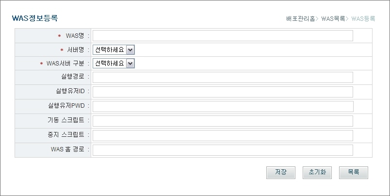

1. WAS명, 서버명, WAS서버구분, 실행경로, 실행유저ID, 실행유저PWD, 기동스크립트, 중지스크립트, WAS홈경로를 입력한다.
2. 서버명을 선택한다. 등록했던 서버명중 해당 WAS가 설치된 서버를 선택한다.
3. WAS서버를 선택한다. weblogic, jeus, jboss중 선택가능.
4. '저장' 버튼을 클릭한다.
5. WAS 정보가 등록된 후 WAS목록 화면으로 이동한다.
6. '초기화' 버튼을 클릭하여 작성한 내용을 초기화한다.
7. '목록' 버튼을 클릭하여 WAS 목록 화면으로 이동한다.

### 배포작업 등록

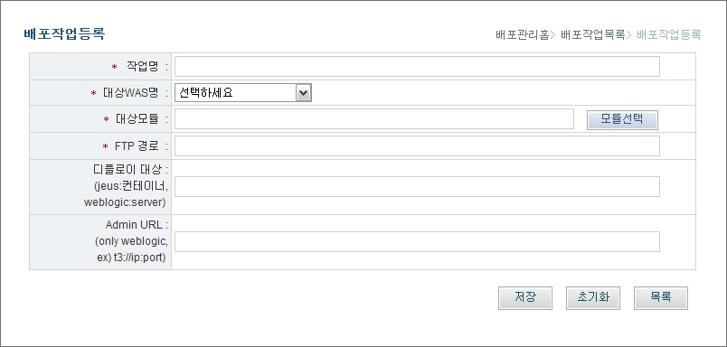

1. 작업명, 대상WAS명, 대상모듈, FTP경로 등을 입력한다.
2. 대상WAS명을 선택한다. 등록했던 WAS명중 작업대상을 선택한다.
3. '모듈선택' 버튼을 클릭하여 배포대상모듈을 선택한다.
4. 디플로이 대상을 입력한다. jeus인 경우 컨테이너명, weblogic인 경우 server명을 입력한다.
5. Admin URL을 입력한다. weblogic인 경우 입력한다.
6. '저장' 버튼을 클릭한다.
7. 배포작업 정보가 등록된 후 배포작업목록 화면으로 이동한다.
8. '초기화' 버튼을 클릭하여 작성한 내용을 초기화한다.
9. '목록' 버튼을 클릭하여 배포작업목록 화면으로 이동한다.

### FTP

[배포작업목록 조회]
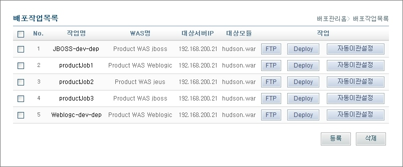

[FTP 작업중]
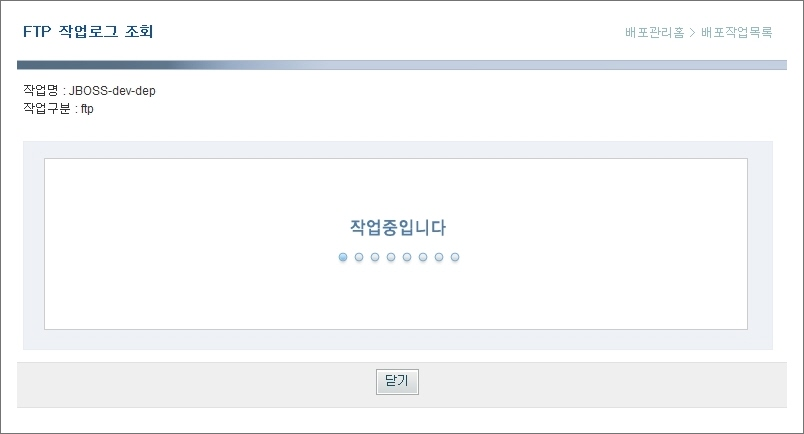

[작업완료 후 작업로그]
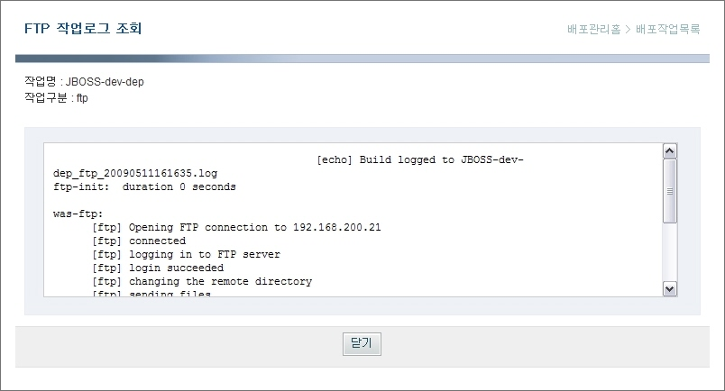

1. 배포작업목록을 조회한다.
2. 대상 작업의 'FTP' 버튼을 클릭하여 대상모듈을 해당 WAS로 전송한다.
3. FTP가 진행되는 도중 '작업중입니다.'메시지를 보여준다.
4. 전송이 완료되면 FTP 작업로그를 화면에 보여준다.

### Deploy

[배포작업목록 조회]


[Deploy 작업중]
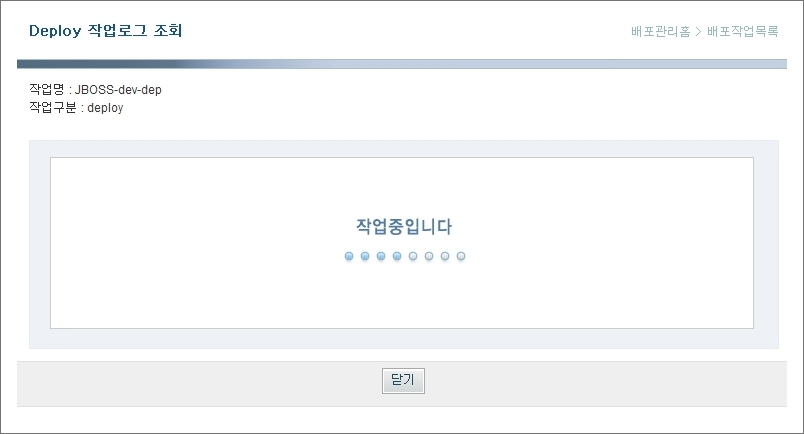

[작업완료 후 작업로그]
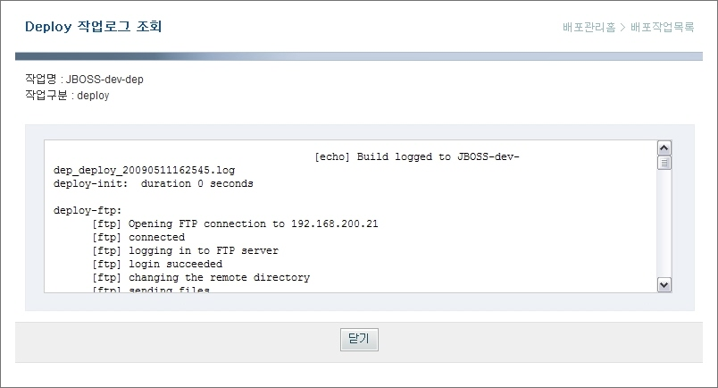

1. 배포작업목록을 조회한다.
2. 대상 작업의 'Deploy' 버튼을 클릭하여 WAS에 Deploy한다.
3. Deploy가 진행되는 도중 '작업중입니다.'메시지를 보여준다.
4. Deploy가 완료되면 Deploy 작업로그를 화면에 보여준다.

### WAS 기동

[WAS목록 조회]
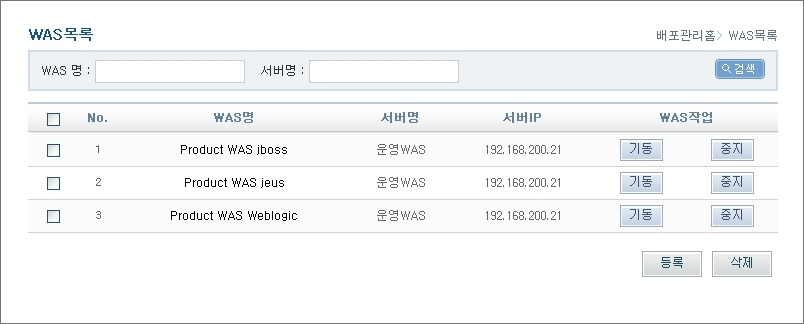

[WAS기동 작업중]


[WAS기동 작업완료]
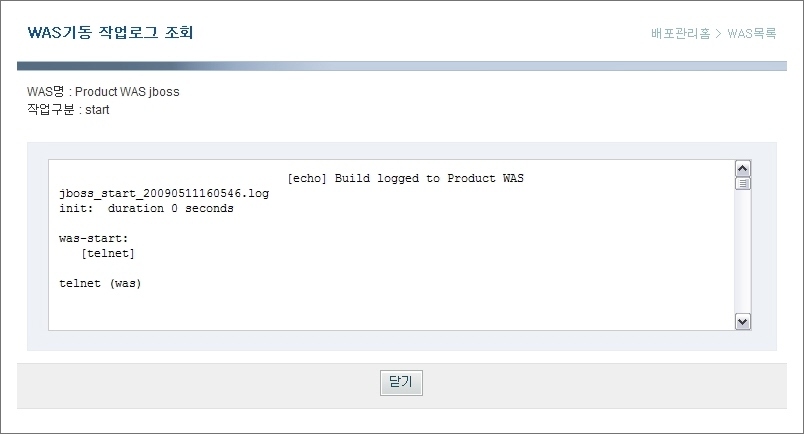

1. WAS목록을 조회한다.
2. 대상 WAS의 '기동' 버튼을 클릭하여 WAS를 기동한다.
3. WAS 기동작업이 진행되는 도중 '작업중입니다.'메시지를 보여준다.
4. WAS 기동작업이 완료되면 WAS 기동 작업로그를 화면에 보여준다.

### WAS 중지

[WAS목록 조회]


[WAS중지 작업중]


[WAS중지 작업완료]
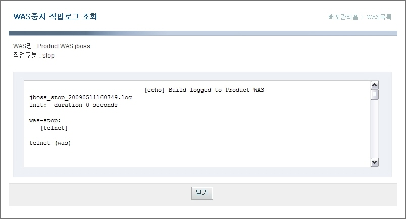

1. WAS목록을 조회한다.
2. 대상 WAS의 '중지' 버튼을 클릭하여 WAS를 중지한다.
3. WAS 중지작업이 진행되는 도중 '작업중입니다.'메시지를 보여준다.
4. WAS 중지작업이 완료되면 WAS 중지 작업로그를 화면에 보여준다.

### 작업로그 조회

[작업로그목록 조회]


[작업로그상세 조회]
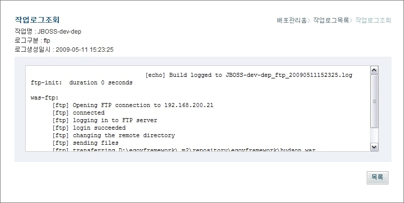

1. 검색조건(로그구분 및 검색기간)을 입력하고 '검색' 버튼을 클릭한다.
2. 검색조건에 해당하는 작업로그 정보를 보여준다.
3. 상세조회할 '작업로그'를 클릭하면 해당작업의 작업로그 조회 화면으로 이동하여 상세정보를 보여준다.
4. '목록' 버튼을 클릭하면 작업로그목록 화면으로 이동한다.
