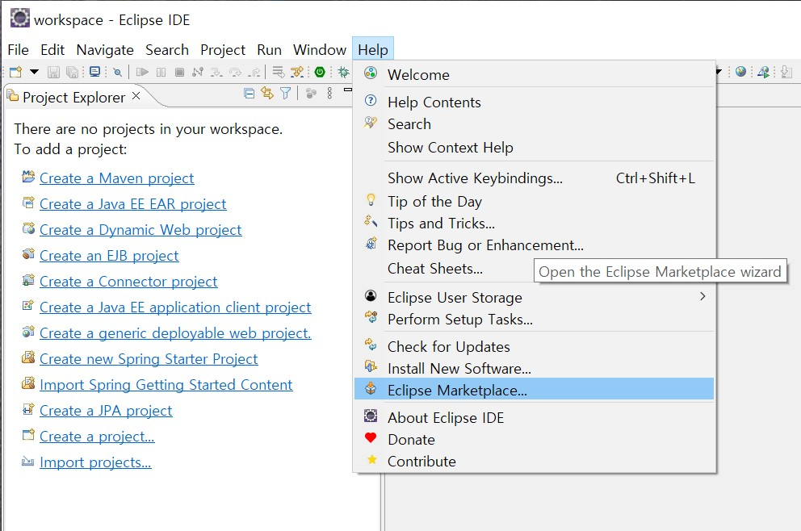
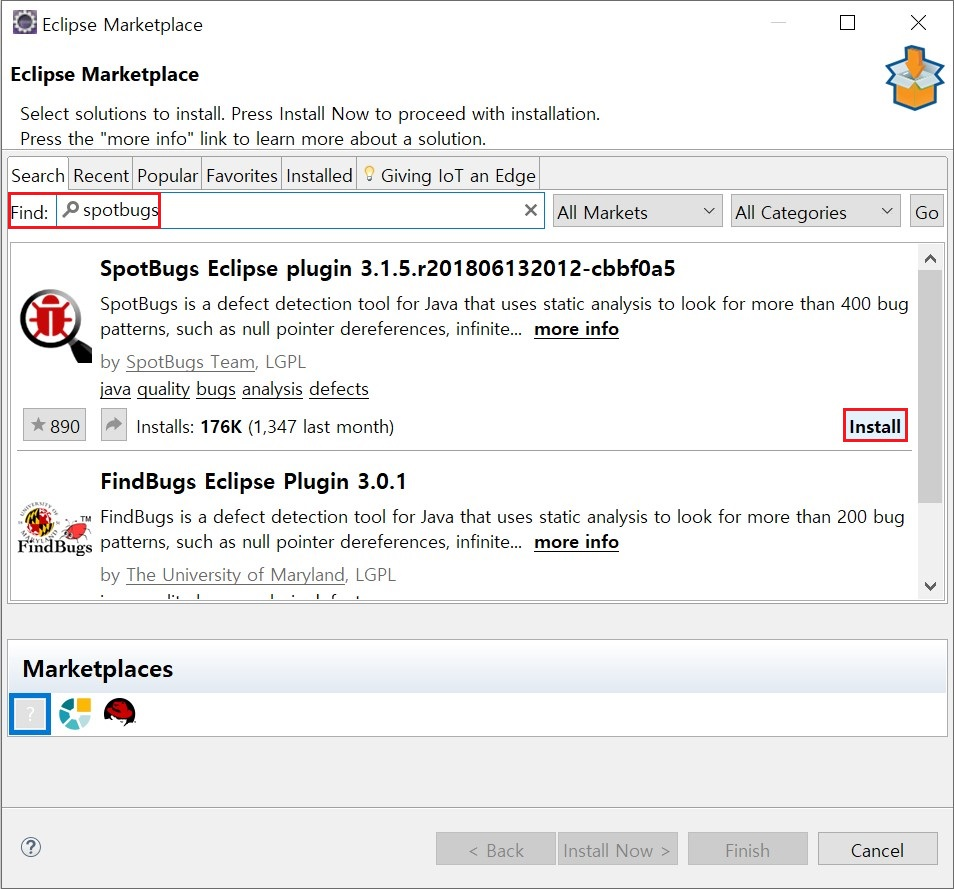
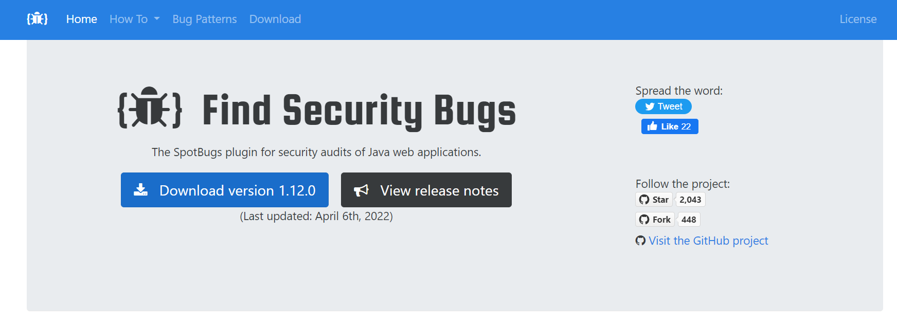
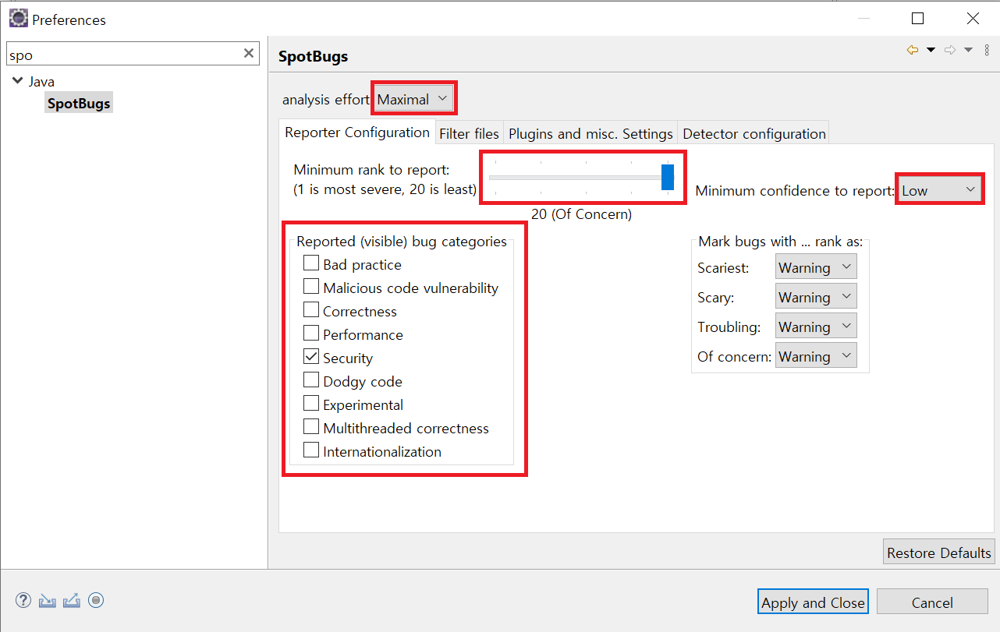
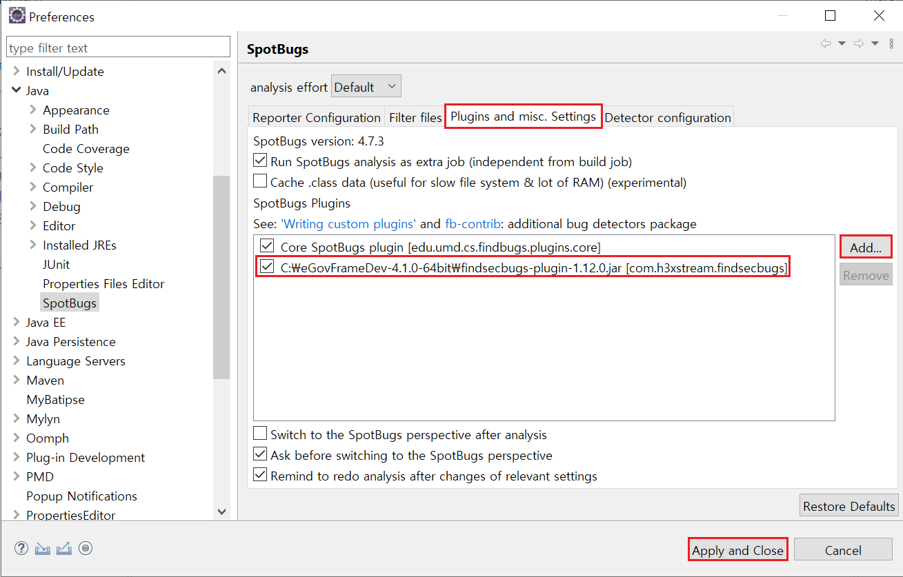
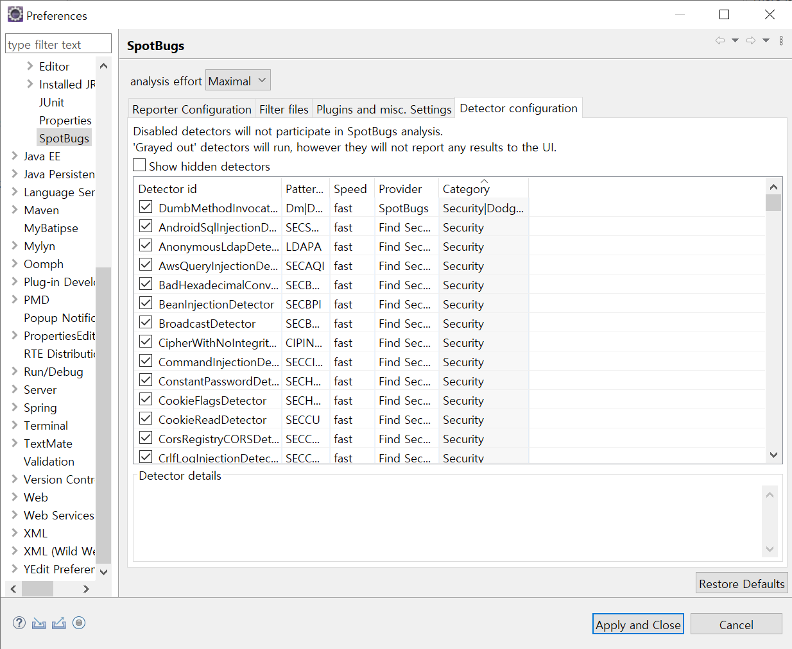
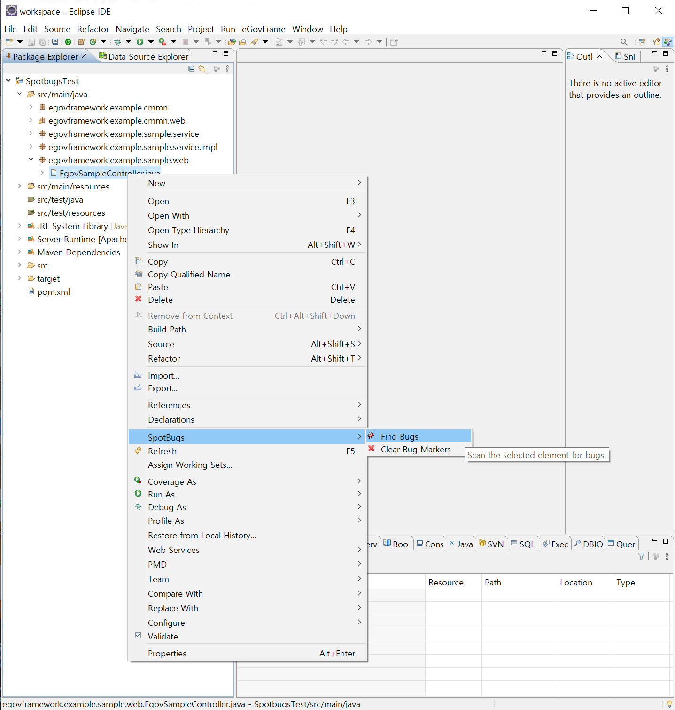
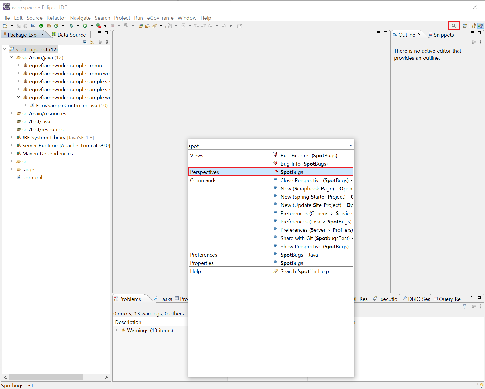
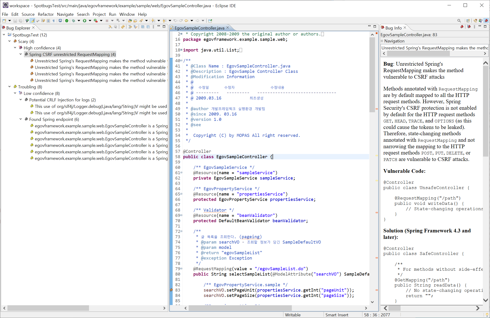

# Find Security Bugs

## 개요

버그 및 보안취약점 등 정적 소스코드 분석이 가능한 오픈소스로 SpotBugs(구 FindSecurityBugs)를 추가할 수 있다.

## 설명

SpotBugs는 Philippe Arteau에서 만든 자바 웹 애플리케이션에 대한 보안 감사를 지원하는 플러그인이다.

2024년 5월에 4.8.5 버전이 배포되었고, 특징은 다음과 같다.

* 823개 이상의 고유 API 시그니처를 가진 141개의 다른 취약성 유형을 검출 가능
* Spring-MVC, Struts, Tapestry등 다양한 소프트웨어 개발 프레임워크를 지원
* Eclipse, IntelliJ, Android Studio, NetBeans 등 통합개발환경(IDE) 도구에 플러그인으로 활용 가능, Ant와 Maven에선 커맨드라인으로 활용 가능
* Jenkins와 SonarQube와 같은 CI(Continuous Integration) 도구에서 활용 가능
* OWASP TOP 10과 CWE를 커버하는 광범위한 참조 제공
* SpotBugs는 오픈소스이며 contributions에 열려있음

공식 홈페이지인 [https://github.com/spotbugs/spotbugs](https://github.com/spotbugs/spotbugs) 를 통해 소프트웨어에 대한 소개와 튜토리얼을 제공하고 있으며, LGPL 공개소프트웨어 라이선스에 따라 소프트웨어 다운로드 기능을 제공한다.

## 행정안전부 49개 보안약점 관련 SpotBugs 기존 탐지 룰(Detector)

| 보안 항목                                          | 관련 Detector                                                                                                                                                     | 룰설명                                                                                                     |
| -------------------------------------------------- | ----------------------------------------------------------------------------------------------------------------------------------------------------------------- | ---------------------------------------------------------------------------------------------------------- |
| SQL 삽입                                           | SqlInjectionDetector AndroidSqlInjectionDetector                                                                                                             | SQL문의 입력값이 고정된 값이 아니고 PreparedStatement를 사용하지 않는 경우 검사                            |
| 경로 조작 및 자원 삽입                             | PathTraversalDetector                                                                                                                                             | File, FileWriter 등을 외부에서 들어온 값을 통해 사용하는 경우                                              |
| 크로스사이트 스크립트                              | XssServletDetector XssMvcApiDetector XssTwirlDetector XssJspDetector                                                                               | 스크립트가 사용되기 전에 입력 값이 신뢰할 수 없는 소스에서 온 것인지 확인                                  |
| 운영체제 명령어 삽입                               | CommandInjectionDetector                                                                                                                                          | 운영체제 명령어를 환경 변수를 통해 받아오는 경우 탐지                                                      |
| 위험한 형식 파일 업로드                            | FileUploadFilenameDetector                                                                                                                                        | 신뢰할 수 없는 소스를 이용한 ServletFileUpload 탐지                                                        |
| 신뢰되지 않는 URL 주소로 자동 접속 연결            | UnvalidatedRedirectDetector SpringUnvalidatedRedirectDetector PlayUnvalidatedRedirectDetector                                                           | 신뢰할 수 없는 소스를 이용한 sendRedirect 사용 탐지                                                        |
| XQuery 삽입                                        | XQueryInjectionDetector                                                                                                                                           | XQuery 문을 외부 입력값을 이용해 compile하는 경우 탐지                                                     |
| XPath 삽입                                         | XPathInjectionDetector                                                                                                                                            | XPath 문을 외부 입력값을 이용해 compile 또는 evaluate하는 경우 탐지                                        |
| LDAP 삽입                                          | LdapInjectionDetector                                                                                                                                             | LDAP 필터를 외부 입력값을 이용해 구성하고 search하는 경우 탐지                                             |
| 크로스사이트 요청 위조                             | SpringCsrfProtectionDisabledDetector                                                                                                                              | CSR 방어가 비활성화 되어 있는 경우 탐지                                                                    |
| HTTP 응답분할                                      | HttpResponseSplittingDetector                                                                                                                                     | 외부 입력 값을 통해 addHeader(), setHeader() 등의 메소드 사용 탐지                                         |
| 보안기능 결정에 사용되는 부적절한 입력값           | ServletEndpointDetector                                                                                                                                           | 신뢰할 수 없는 소스에서 불러온 값을 사용하는 경우 탐지                                                     |
| 포맷스트링 삽입                                    | FormatStringManipulationDetector                                                                                                                                  | 신뢰할 수 없는 값을 포맷팅하는 경우 탐지                                                                   |
| 부적절한 인가                                      | InsecureSmtpSslDetector                                                                                                                                           | 보안 기능이 고려되지 않은 API를 사용하여 인증없이 연결하는 경우 탐지                                       |
| 중요한 자원에 대한 잘못된 권한 설정                | ExternalFileAccessDetector CookieFlagsDetector PersistentCookieDetector                                                                                 | 보안 기능이 비활성화된 쿠키를 사용하는 경우 탐지                                                           |
| 취약한 암호화 알고리즘 사용                        | CustomMessageDigestDetector PotentialValueDetector DesUsageDetector TDesUsageDetector RsaNoPaddingDetector CipherWithNoIntegrityDetector | 취약하다고 알려진 암호화 알고리즘 사용 탐지                                                                |
| 중요정보 평문저장                                  | UnencryptedSocketDetector UnencryptedServerSocketDetector                                                                                                    | 암호화되지 않는 소켓, 서버 소켓 사용 탐지                                                                  |
| 중요정보 평문전송                                  | UnencryptedSocketDetector UnencryptedServerSocketDetector                                                                                                    | 암호화되지 않는 소켓, 서버 소켓 사용 탐지                                                                  |
| 하드코드된 비밀번호                                | DumbMethodInvocations ConstantPasswordDetector                                                                                                               | 데이터베이스의 비밀번호가 고정 값이거나 특정 메소드(setProperty)의 인자값을 고정 값으로 사용하는 경우 탐지 |
| 충분하지 않은 키 길이 사용                         | InsufficientKeySizeBlowfishDetector InsufficientKeySizeRsaDetector                                                                                           | 암호화 알고리즘의 권장 키 길이 미만인 경우 탐지                                                            |
| 적절하지 않은 난수 값 사용                         | PredictableRandomDetector                                                                                                                                         | 적절하지 않다고 알려진 난수 생성 메소드 사용 탐지                                                          |
| 하드코드된 암호화 키                               | ConstantPasswordDetector                                                                                                                                          | 하드코드된 암호화 키 사용 탐지                                                                             |
| 사용자 하드디스크에 저장되는 쿠키를 통한 정보 노출 | PersistentCookieDetector                                                                                                                                          | 매우 긴 수명을 가진 쿠키 사용 탐지 세션 만료 시간이 부적절한 경우                                          |
| 솔트 없이 일방향 해쉬 함수 사용                    | PotentialValueDetector                                                                                                                                            | Update를 통해 솔트 값을 업데이트하지 않는 경우 검사                                                        |
| 무결성 검사없는 코드 다운로드                      | FileDisclosureDetector SSRFDetector                                                                                                                          | 외부에서 받은 값을 검사 없이 그대로 실행하는 경우 탐지                                                     |
| 오류메세지 통한 정보 노출                          | ErrorMessageExposureDetector                                                                                                                                      | 스택 정보가 유출되는 경우 탐지                                                                             |
| 잘못된 세션에 의한 데이터 정보 노출                | ServletEndpointDetector                                                                                                                                           | 클라이언트에 의해 변조될 수 있는 세션 ID를 사용하는 경우 탐지                                              |
| 시스템 데이터 정보 노출                            | SSRFDetector FileDisclosureDetector                                                                                                                          | 예외 처리에서 시스템 데이터가 노출되는 경우 탐지                                                           |
| DNS lookup에 의존한 보안 결정                      | ServletEndpointDetector                                                                                                                                           | getServerName() 또는 getHeader(“Host”)를 사용해 호스트의 이름을 사용하는 경우 탐지                       |
| 취약한 API 사용                                    | UnencryptedSocketDetector                                                                                                                                         | 암호화되지 않은 Socket 사용 탐지                                                                           |

## 설치

#### Spotbugs 설치

(참고 : 표준프레임워크 통합개별환경은 이미 설치되어있음)

##### 1. Help > Eclipse MarketPlace...를 선택한다.

##### 2. Find 창에서 Spotbugs를 검색하고 install 한다.

## 설정

1. [https://find-sec-bugs.github.io/](https://find-sec-bugs.github.io/) 에서 플러그인을 다운로드 받는다.

   
2. Eclipse > Windows > Prefeneces > Spotbugs 선택== [Reporting configuration]탭의 [Reported (Visible) bug categories]목록에서 [Security]만 체크되어 있는지 확인한다.

   
3. [ Plugins and misc . settings ]섹션에 보안 버그 검색 플러그인을 추가할 수 있다. Add… 클릭하여 다운로드 받은 findsecbugs-plugin.jar 파일을 선택한다.
   플러그인이 추가되어있는지 확인하고 Apply and Close 버튼을 클릭하여 플러그인 설치를 완료한다.

   

✔ 설치가 제대로 되지 않았다면 이클립스를 다시 시작한다.

4. 다시 Spotbugs Preference창을 열어서 Detector configuration 탭을 선택한다. FindSecurityBugs의 룰셋들이 추가된 것을 확인할 수 있다.

   

✔ detector 목록에서 Category 탭을 클릭하면 Category 순서로 정렬된다.
✔ 체크박스를 해제하면 제외하고 싶은 일부의 detector를 실행 중지할 수 있다.

## 실행

1. 분석하려는 프로젝트 또는 패키지를 선택하고 마우스 오른쪽 버튼 클릭, Spotbugs > Findbugs를 선택한다.

   

✔ 이클립스의 Package Explorer에서 특정 파일을 선택하고 진행하면 특정 파일만 분석이 가능하다.
✔ 기존에 분석한 내용을 깨끗하게 지우고 다시 분석하려면 마우스 오른쪽 버튼 클릭, Spotbugs > Clear Bug Marker를 선택한다.

## 결과 확인

1. Windows > Perspective > Open Perspective > Other.. 선택 또는 오른쪽 상단의 돋보기 버튼을 클릭하여 Spotbugs Perspective 창을 연다.

   
2. Bug Explorer에 분석 단위별 버그 심각도와 항목별 목록이 나타난다.

   

✔ 검출된 버그를 더블클릭하면 버그가 발견된 소스라인으로 이동한다.
✔ Bug Info 탭에서 검출된 버그에 대한 정보를 확인할 수 있다.

## 개발환경의 보안 항목별 관련 룰 보유 여부

|                     보안 항목                     | Spotbugs | FindSecurityBugs | PMD |
| :------------------------------------------------: | :------: | :--------------: | --- |
|              입력 데이터 검증 및 표현              |          |                  |     |
|                   SQL Injection                   |    ○    |        ○        |     |
|                     코드 삽입                     |          |        ○        |     |
|               경로 조작 및 자원 삽입               |    ○    |        ○        |     |
|             XSS (Cross Site Scripting)             |    ○    |        ○        |     |
|                운영체제 명령어 삽입                |          |        ○        |     |
|              위험한 형식 파일 업로드              |          |        ○        |     |
|       신뢰되지 않는 URL 주소로 자동접속 연결       |          |        ○        |     |
|             부적절한 XML 외부개체 참조             |          |        ○        |     |
|                      XML 삽입                      |          |        ○        |     |
|                     LDAP 삽입                     |          |        ○        |     |
|               크로스사이트 요청 위조               |          |        ○        |     |
|                서버사이드 요청 위조                |          |        ○        |     |
|                   HTTP 응답분할                   |    ○    |        ○        |     |
|                 정수형 오버플로우                 |    ○    |                  |     |
|      보안기능 결정에 사용되는 부적절한 입력값      |          |        ○        |     |
|                  포맷 스트링 삽입                  |          |        ○        |     |
|                      보안기능                      |          |                  |     |
|           적절한 인증 없는 중요기능 허용           |          |        ○        |     |
|                   부적절한 인가                   |          |        ○        |     |
|        중요한 자원에 대한 잘못된 권한 설정        |          |        ○        |     |
|            취약한 암호화 알고리즘 사용            |          |        ○        |     |
|              암호화되지 않은 중요정보              |          |        ○        |     |
|                하드코드된 중요정보                |          |        ○        | ○  |
|             충분하지 않은 키 길이 사용             |          |        ○        |     |
|             적절하지 않은 난수값 사용             |    ○    |        ○        |     |
|                취약한 비밀번호 허용                |          |                  |     |
|               부적절한 전자서명 확인               |          |                  |     |
|            부적절한 인증서 유효성 검증            |    ○    |        ○        |     |
| 사용자 하드디스크에 저장되는``쿠키를 통한 정보노출 |          |        ○        |     |
|         주석문 안에 포함된 시스템 주요정보         |          |                  |     |
|           솔트없이 일방향 해쉬함수 사용           |          |        ○        |     |
|           무결성 검사 없는 코드 다운로드           |          |        ○        |     |
|           반복된 인증시도 제한 기능 부재           |          |                  |     |
|                    시간 및 상태                    |          |                  |     |
|           경쟁조건: 검사시점과 사용시점           |    ○    |                  |     |
|         종료되지 않는 반복문 또는 재귀함수         |    ○    |                  |     |
|                     에러 처리                     |          |                  |     |
|            오류 메시지를 통한 정보노출            |          |        ○        | ○  |
|                오류 상황 대응 부재                |          |                  | ○  |
|                 부적절한 예외 처리                 |    ○    |                  | ○  |
|                     코드 오류                     |          |                  |     |
|                Null Pointer 역참조                |    ○    |                  | ○  |
|                 부적절한 자원 해제                 |    ○    |        ○        | ○  |
|          신뢰할 수 없는 데이터의 역직렬화          |          |        ○        |     |
|                       캡슐화                       |          |                  |     |
|         잘못된 세션에 의한 데이터 정보노출         |          |        ○        |     |
|          제거 되지 않고 남은 디버그 코드          |          |                  |     |
|      Public 메소드로부터 반환된 Private 배열      |    ○    |                  | ○  |
|         Private 배열에 Public 데이터 할당         |    ○    |                  | ○  |
|                      API 오용                      |          |                  |     |
|            DNS lookup에 의존한 보안결정            |          |                  |     |
|                  취약한 API 사용                  |          |        ○        |     |

## 표준프레임워크 예제 포함된 보안 항목

|                     보안 항목                     | 표준프레임워크` ` 예제 포함 | 위키가이드` ` 참조 추가 | 비고                                           |
| :------------------------------------------------: | :------------------------------: | :--------------------------: | ---------------------------------------------- |
|              입력 데이터 검증 및 표현              |                                  |                              |                                                |
|                   SQL Injection                   |                                  |                              |                                                |
|                     코드 삽입                     |                                  |                              |                                                |
|               경로 조작 및 자원 삽입               |                ○                |                              | 2018년 공통컴포넌트``취약점 패치 내용          |
|             XSS (Cross Site Scripting)             |                                  |              ○              |                                                |
|                운영체제 명령어 삽입                |                ○                |                              | 2023년 공통컴포넌트``취약점 패치 내용          |
|              위험한 형식 파일 업로드              |                                  |                              |                                                |
|       신뢰되지 않는 URL 주소로 자동접속 연결       |                ○                |                              | 2019년 공통컴포넌트``보안 패치 (화이트 리스트) |
|             부적절한 XML 외부개체 참조             |                                  |                              |                                                |
|                      XML 삽입                      |                                  |                              |                                                |
|                     LDAP 삽입                     |                                  |                              |                                                |
|               크로스사이트 요청 위조               |                ○                |              ○              | Spring Security 설정``간소화 서비스            |
|                서버사이드 요청 위조                |                                  |                              |                                                |
|                   HTTP 응답분할                   |                                  |                              |                                                |
|                 정수형 오버플로우                 |                                  |                              |                                                |
|      보안기능 결정에 사용되는 부적절한 입력값      |                                  |                              |                                                |
|                  포맷 스트링 삽입                  |                                  |                              |                                                |
|                      보안기능                      |                                  |                              |                                                |
|           적절한 인증 없는 중요기능 허용           |                                  |                              |                                                |
|                   부적절한 인가                   |                                  |                              |                                                |
|        중요한 자원에 대한 잘못된 권한 설정        |                                  |                              |                                                |
|            취약한 암호화 알고리즘 사용            |                ○                |              ○              | 2018년 공통컴포넌트``취약점 패치 내용          |
|              암호화되지 않은 중요정보              |                                  |                              |                                                |
|                하드코드된 중요정보                |                ○                |              ○              | Crypto 간소화 서비스                           |
|             충분하지 않은 키 길이 사용             |                                  |                              |                                                |
|             적절하지 않은 난수값 사용             |                ○                |                              |                                                |
|                취약한 비밀번호 허용                |                                  |                              |                                                |
|               부적절한 전자서명 확인               |                                  |                              |                                                |
|            부적절한 인증서 유효성 검증            |                                  |                              |                                                |
| 사용자 하드디스크에 저장되는``쿠키를 통한 정보노출 |                ○                |                              |                                                |
|         주석문 안에 포함된 시스템 주요정보         |                                  |                              |                                                |
|           솔트없이 일방향 해쉬함수 사용           |                ○                |                              |                                                |
|           무결성 검사 없는 코드 다운로드           |                                  |                              |                                                |
|           반복된 인증시도 제한 기능 부재           |                                  |                              |                                                |
|                    시간 및 상태                    |                                  |                              |                                                |
|           경쟁조건: 검사시점과 사용시점           |                ○                |                              |                                                |
|         종료되지 않는 반복문 또는 재귀함수         |                                  |                              |                                                |
|                     에러 처리                     |                                  |                              |                                                |
|            오류 메시지를 통한 정보노출            |                                  |                              |                                                |
|                오류 상황 대응 부재                |                ○                |                              |                                                |
|                 부적절한 예외 처리                 |                                  |                              |                                                |
|                     코드 오류                     |                                  |                              |                                                |
|                Null Pointer 역참조                |                                  |                              |                                                |
|                 부적절한 자원 해제                 |                                  |                              |                                                |
|          신뢰할 수 없는 데이터의 역직렬화          |                                  |                              |                                                |
|                       캡슐화                       |                                  |                              |                                                |
|         잘못된 세션에 의한 데이터 정보노출         |                                  |                              |                                                |
|          제거 되지 않고 남은 디버그 코드          |                                  |                              |                                                |
|      Public 메소드로부터 반환된 Private 배열      |                                  |                              |                                                |
|         Private 배열에 Public 데이터 할당         |                                  |                              |                                                |
|                      API 오용                      |                                  |                              |                                                |
|            DNS lookup에 의존한 보안결정            |                                  |                              |                                                |
|                  취약한 API 사용                  |                                  |                              |                                                |

## 참고사이트

1. FindSecurityBugs, [http://find-sec-bugs.github.io/](http://find-sec-bugs.github.io/)
2. 보안약점 진단 가이드, [https://www.kisa.or.kr/2060204/form?postSeq=9&amp;page=1](https://www.kisa.or.kr/2060204/form?postSeq=9&page=1)
3. SpotBugs, FindSecurityBugs, PMD 보안약점 관련 룰, [https://www.mois.go.kr/frt/bbs/type001/commonSelectBoardArticle.do?bbsId=BBSMSTR_000000000012&amp;nttId=73814](https://www.mois.go.kr/frt/bbs/type001/commonSelectBoardArticle.do?bbsId=BBSMSTR_000000000012&nttId=73814)
4. 표준프레임워크 보안 개발 가이드, [https://www.egovframe.go.kr/home/ntt/nttRead.do?pagerOffset=0&amp;searchKey=&amp;searchValue=&amp;menuNo=76&amp;bbsId=171&amp;nttId=1813](https://www.egovframe.go.kr/home/ntt/nttRead.do?pagerOffset=0&searchKey=&searchValue=&menuNo=76&bbsId=171&nttId=1813)
