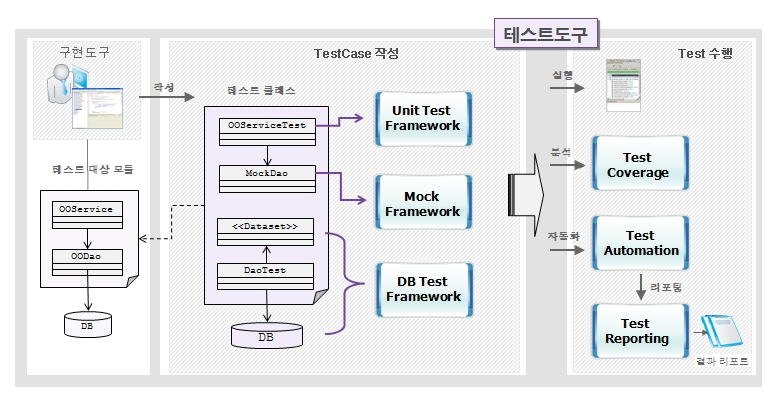

# Unit Test

## 개요

개발한 대상 코드에 대해 테스트하고자 개발자가 작성한 테스트를 위한 코드로서의 Unit Test 에 대해 가이드한다.

## 설명

Unit Test란 대상 코드에 대해 테스트하고자 개발자가 작성한 코드로서, 주로 특정 메소드를 실행해서 그 결과가 기대값과 일치하는지 확인하는 형태이며, Unit Test는 서로 독립적으로 수행되어야 한다.   

* 효과  
   * 작성한 코드의 설계 개선 작업 시, 코드 품질에 대한 확신  
   * 코드 수정 시 버그를 쉽게 찾을 수 있게 해줌  
   * 자동화된 회귀 테스트 (Regression Test)를 가능하게 해주는 Source가 됨
* 작성범위  
   * 주요 흐름에 대한 테스트 (the happy path)  
   * 또 다른 주요 흐름에 대한 테스트 (the main alternative path)  
   * 경계 조건에 대한 테스트 (null 인자 체크 등)  
   * Exception 테스트 (Exception 발생하는 조건에 대한 테스트)

제공하는 테스트 도구는 Unit Test, Mock, DB Test Framework을 통해 TestCase 작성을 지원하고, Test Automation, Test Coverage, Test Reporting 등의 기능을 제공한다.


### TestCase 작성

* 개발자가 구현도구를 통해 코드를 작성할 때, 그 코드를 대상으로 하는 TestCase를 작성할 수 있다.  
 예를 들어, OOService 클래스의 TestCase인 OOServiceTest를 작성할 수 있는 기반 Framework인 Unit Test Framework을 제공한다. - [Test Case](./test-case.md)
* 개발자가 테스트하고자하는 OOService와 관련있는 OODao에 대해서, MockDao를 작성할 수 있는 라이브러리를 제공한다. 혹은, 이미 구현된 기능을 제공하는 Mock 객체도 제공한다. - [Mock Support](./mock-support.md)
* Dao와 DB에 걸쳐진 Persistence Layer를 테스트할 수 있는 DB Test Framework을 제공하여 DB 연결, 데이터 초기화, 트랜잭션 처리 등 DB Test를 위한 TestCase 작성을 지원한다. - [DB Support](./db-support.md)

### Test 수행

* 작성한 TestCase를 수행하여 성공/실패 여부를 알려준다.
* TestCase가 작성된 범위를 수치나 코드 라인으로 알려줌으로써 TestCase가 테스트하지 못한 영역을 알려준다. - [Test Coverage](./test-coverage.md)
* 작성된 TestCase를 자동화하여 수시로 테스트할 수 있도록 한다. - [Test Automation](./test-automation.md)

### Test Reporting

* Coverage 분석 : 테스트 대상 모듈에 대해 테스트 클래스가 테스트를 수행하는 그 범위를 수치를 분석하여, 테스트 수행 범위를 보여줌 - [Test Coverage](./test-coverage.md)
* Test Reporting : 테스트를 수행한 결과를 Text, Html, XML, Excel 등의 보고서 형태로 작성함 - [Test Reporting](./test-reporting.md)

### 사용 된 오픈 소스

각 표준프레임워크 개발환경 버전별 사용된 오픈소스는 구성 가이드에서 확인 가능하다.   

| 이름 | 설명 |
|------|------|
| [JUnit](http://junit.org/) | 단위 테스트 클래스 작성과 실행을 위한 기본적인 기능을 제공 |
| [EasyMock](http://www.easymock.org/) | 단위 테스트 클래스 작성 시 Mocking 을 위해 사용 |
| [DbUnit](http://dbunit.sourceforge.net/) | 데이터베이스 관련 Test Fixture 자동 생성 등의 DB Support 를 위해 사용 |
| [EMMA](http://emma.sourceforge.net/) | Test Coverage 분석 |
| [Spring Test](http://www.springsource.org/) | Springframework 의 Test 관련 기능 활용 |
| [Unitils](http://unitils.sourceforge.net/) | JUnit, EasyMock, DbUnit, Spring Test, Ibatis, Hibernate 등을 유연한 구조로 엮어서 테스트할 수 있는 기반 구조 및 유틸을 제공 |
| [Ant](http://ant.apache.org/) | Java-based build tool |
| [Maven](http://unitils.sourceforge.net/summary.html) | 프로젝트 관리 도구 |
| [EclEmma](http://www.eclemma.org) | EMMA Eclipse Plug-in |

## 환경설정

Maven Project 인 경우에는 아래와 같은 dependency 를 설정하면 된다.

```xml
<dependency>
    <groupId>junit</groupId>
    <artifactId>junit</artifactId>
    <version>4.4</version>
    <scope>test</scope>
</dependency>

<dependency>
    <groupId>org.easymock</groupId>
    <artifactId>easymock</artifactId>
    <version>2.4</version>
    <scope>test</scope>
</dependency>

<dependency>
    <groupId>org.easymock</groupId>
    <artifactId>easymockclassextension</artifactId>
    <version>2.4</version>
    <scope>test</scope>
</dependency>

<dependency>
    <groupId>org.dbunit</groupId>
    <artifactId>dbunit</artifactId>
    <version>2.4.3</version>
    <scope>test</scope>
</dependency>

<dependency>
    <groupId>org.unitils</groupId>
    <artifactId>unitils</artifactId>
    <version>2.2</version>
    <scope>test</scope>
</dependency>
```

> ✔ **주의**: Springframework 2.5 에서는 JUnit 4.5 버전이 동작하지 않으므로, JUnit 4.4 버전을 사용하도록한다.   
> ✔ **주의**: Test Automation / Test Reporting / Test Coverage 분석 관련하여서는 Test Automation, Test Reporting, Test Coverage 를 참조하도록 한다.   
> ✔ 필요할 경우 Maven > Update project configuration 를 수행하여 반영할 수 있다.

## 사용법

Unit Test Case 는 다음과 같은 구조로 이루어져 있다.

* 테스트 프레임웍을 사용하는 Class
* 공용으로 사용하는 테스트 데이터 (test fixture)
* 테스트 데이터 준비 (Setup of test data)
* 테스트 메소드 (testXXX)  
   * (테스트 별 준비)  
   * 테스트 대상 메소드 실행  
   * assert 문을 이용한 결과 확인 (assertTrue, assertEquals etc.)

이를 직접 작성하면 된다.

기본적인 JUnit 기술은 [Test Case](./test-case.md) 을 참조하도록 하며, 필요할 경우 나아가 [Mock Support](./mock-support.md), [DB Support](./db-support.md) 또한 함께 살펴보도록 한다.

## 샘플

* 기본적인 JUnit Test Case 작성 예 : [Test Case](./test-case.md)
* Mocking 을 이용한 Test Case 작성 예 : [Mock Support](./mock-support.md)
* DAO 테스트를 위한 Test Case 작성 예 : [DB Support](./db-support.md)

## 참고자료

* [Unitils Guildelines](http://unitils.sourceforge.net/guidelines.html)
* [Mock Object를 사용해서 쉽게 테스트하기](http://www.ibm.com/developerworks/kr/event/screencast/final/01/)
* [Effective Unit Testing with DbUnit](http://www.onjava.com/pub/a/onjava/2004/01/21/dbunit.html)
* [An early look at JUnit4](http://www.ibm.com/developerworks/java/library/j-junit4.html)