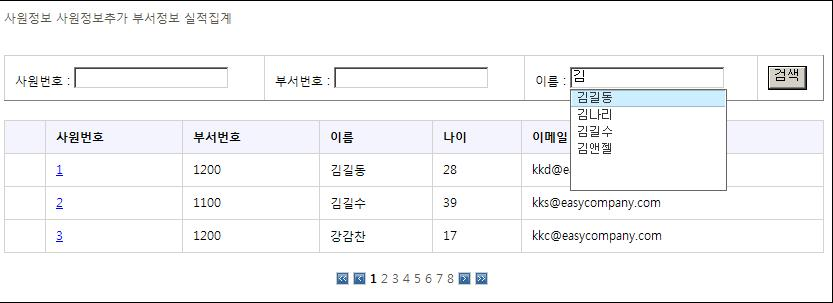
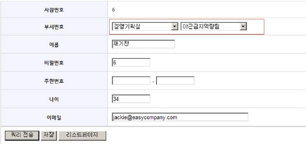

# Ajax 지원 서비스

## 개요

일반적으로 Ajax 기능은 javascript 언어로 개발하나, server-side 구현에 익숙한 J2EE 개발자들에게는 쉽지 않은 작업이 될 수 있다.
Ajax 지원 서비스에서는 Ajax를 이용해 자주 사용되는 기능을 custom tag형태로 제공한다.
기능은 오픈소스 라이브러리인 AjaxTags를 이용한다.

## 설명

### 설치

**시스템 환경 및 필요 라이브러리**

- JDK 1.5
- Servlet container running Servlets 2.4+ and JSP 2.0+ (jsp-api 2.0,servlet-api 2.4)
- [AjaxTags 라이브러리](http://ajaxtags.sourceforge.net/)

**설치 순서**

1. [AjaxTags Download](http://sourceforge.net/project/showfiles.php?group_id=140499) 사이트에 가서 해당 라이브러리를 download한 후 WEB-INF/lib에 위치시킨다.
2. web.xml 설정.

```xml
<servlet>
    <servlet-name>sourceloader</servlet-name>
    <servlet-class>net.sourceforge.ajaxtags.servlets.SourceLoader</servlet-class>

    <init-param>
        <param-name>prefix</param-name>
        <param-value>/ajaxtags</param-value>
    </init-param>
</servlet>

<servlet-mapping>
    <servlet-name>sourceloader</servlet-name>
    <url-pattern>/ajaxtags/js/*</url-pattern>
</servlet-mapping>

<servlet-mapping>
    <servlet-name>sourceloader</servlet-name>
    <url-pattern>/ajaxtags/img/*</url-pattern>
</servlet-mapping>

<servlet-mapping>
    <servlet-name>sourceloader</servlet-name>
    <url-pattern>/ajaxtags/css/*</url-pattern>
</servlet-mapping>
```

### AjaxTags Tag Reference

**ajax:autocomplete**

자동완성기능. 보통 검색 입력창에 prefix 문자를 입력하면 해당 추천 검색어를 보여주는 방식으로 이용.

| 파라미터              | 설명                                                                           | 필수여부 |
|-------------------|------------------------------------------------------------------------------|------|
| baseUrl           | 자동완성기능을 위한 결과 데이터를 보내주는 server-side 액션을 위한 URL.                              | yes  |
| source            | 추천 검색어 리스트를 보여줄 텍스트 필드 이름. 입력 필드에 추천 검색리스트를 보여준다면 target과 source를 동일하게 입력한다. | yes  |
| target            | 사용자가 입력하는 텍스트 필드 이름.                                                         | yes  |
| parameters        | baseUrl에 추가할 파라미터들.여러개일 경우 comma로 구별한다.                                      | yes  |
| className         | 추천 검색리스트에 적용할 CSS 클래스이름                                                      | yes  |
| indicator         | Ajax 요청중일때 보여줄 표시.                                                           | no   |
| minimumCharacters | Ajax 요청을 위한 최소 입력값.                                                          | no   |
| preFunction       | Ajax 요청이 시작되기 전에 동작하는 function 이름.                                           | no   |
| postFunction      | Ajax 요청이 완료된 후에 동작하는 function 이름.                                            | no   |
| errorFunction     | Ajax 요청 error시에 동작하는 function 이름.                                            | no   |


**ajax:select**


하나의 셀렉트박스에서 값을 변경하면 다른 셀렉트박스에 연관된 값으로 리스트를 구성. Linked SelectBox.

| 파라미터           | 설명                                                                           | 필수여부 |
|----------------|------------------------------------------------------------------------------|------|
| baseUrl        | 자동완성기능을 위한 결과 데이터를 보내주는 server-side 액션을 위한 URL.                              | yes  |
| source         | 추천 검색어 리스트를 보여줄 텍스트 필드 이름. 입력 필드에 추천 검색리스트를 보여준다면 target과 source를 동일하게 입력한다. | yes  |
| target         | 사용자가 입력하는 텍스트 필드 이름.                                                         | yes  |
| parameters     | baseUrl에 추가할 파라미터들.여러개일 경우 comma로 구별한다.                                      | no   |
| eventType      | no                                                                           |
| executeOnLoad  | 응답 데이터로 select box를 구성하는 중일때 구성중인지를 별도 표시를 할지 여부.[default=false]             | no   |
| defaultOptions | Ajax 응답값이 없을때 보여줄 기본 리스트. comma로 구별하여 작성한다.                                  | no   |
| preFunction    | Ajax 요청이 시작되기 전에 동작하는 function 이름.                                           | no   |
| postFunction   | Ajax 요청이 완료된 후에 동작하는 function 이름.                                            | no   |
| errorFunction  | Ajax 요청 error시에 동작하는 function 이름.                                            | no   |
| parser         | 응답 데이터에 대한 parser.[default=ResponseHtmlParser]                               | no   |


**ajax:tabPanel**

탭으로 구성된 페이지들 새로 고침 없이 보여 줄때.

| 파라미터          | 설명                                             | 필수여부 |
|---------------|------------------------------------------------|------|
| id            | tabPanel의 ID                                   | yes  |
| preFunction   | Ajax 요청이 시작되기 전에 동작하는 function 이름.             | no   |
| postFunction  | Ajax 요청이 완료된 후에 동작하는 function 이름.              | no   |
| errorFunction | Ajax 요청 error시에 동작하는 function 이름.              | no   |
| parser        | 응답 데이터에 대한 parser.[default=ResponseHtmlParser] | no   |

**others**

이외에도 여러 기능이 있다. AjaxTags의 Tag 레퍼런스 및 사용법은 아래 AjaxTags 사이트에서 확인할 수 있다.

### 공통적인 개발 작업

AjaxTags의 어떤 태그를 사용하던지, 아래의 작업은 공통적으로 발생한다.

#### JSP

**태그 라이브러리 선언**

```jsp
<%@ taglib prefix="ajax" ri="http://ajaxtags.sourceforge.net/tags/ajaxtags" %>
```

**Javascript, CSS 선언**

```jsp
<script type="text/javascript" src="<%=request.getContextPath()%>/ajaxtags/js/prototype.js"></script>
<script type="text/javascript" src="<%=request.getContextPath()%>/ajaxtags/js/scriptaculous/scriptaculous.js"></script>
<script type="text/javascript" src="<%=request.getContextPath()%>/ajaxtags/js/overlibmws/overlibmws.js"></script>
<script type="text/javascript" src="<%=request.getContextPath()%>/ajaxtags/js/ajaxtags.js"></script>
<link type="text/css" rel="stylesheet" href="<%=request.getContextPath()%>/ajaxtags/css/ajaxtags.css" />
<link type="text/css" rel="stylesheet" href="<%=request.getContextPath()%>/ajaxtags/css/displaytag.css" />
```

#### Controller

AjaxTags를 사용하기 위해서는 결과 데이터가 AjaxTags에서 데이터 형식(XML style)을 갖추어야 한다.
이를 위해 AjaxTags는 AjaxXmlBuilder라는 데이터 가공을 위한 API를 제공한다.
결과 데이터를 AjaxXmlBuilder를 이용해서 변환하는 작업을 View에서 할 수도 있지만, View의 갯수가 기능 단위로 추가될 수도 있으므로,
Controller에서 변환한 후에 Model 객체에 담아서 View로 보내고 View는 공통으로 하나를 사용하기를 권한다.

**org.ajaxtags.helpers.AjaxXmlBuilder**

ajaxXml model에 추가하기

```java
List<Department> deptList = departmentService.getDepartmentList(param);
AjaxXmlBuilder ajaxXmlBuilder = new AjaxXmlBuilder();
for (Iterator iter = deptList.iterator(); iter.hasNext();) {
  Department dept = (Department) iter.next();
  ajaxXmlBuilder.addItem(dept.getDeptname(), dept.getDeptid());
}
model.addObject("ajaxXml",ajaxXmlBuilder.toString());
```

결과 데이터는 다음과 같다.

```xml
<?xml version="1.0" encoding="UTF-8"?>
<ajax-response>
  <response>
    <item>
      <name>점심메뉴기획팀</name>
      <value>1200</value>
    </item>
    <item>
      <name>야근금지역량팀</name>
      <value>1300</value>
    </item>
    ...
  </response>
</ajax-response>
```

#### View

JSP 페이지에 프린트되는 일반적인 응답방식이 아니므로, 응답 처리를 위한 공통 View를 만들어야 한다.
결과데이터의 형식(XML)을 응답 객체에 설정한다.
Controller에서 보낸 Model객체의 결과데이터를 꺼내 write한다.

```java
package com.easycompany.view;
 
import java.io.PrintWriter;
import java.util.Map;
import javax.servlet.http.HttpServletRequest;
import javax.servlet.http.HttpServletResponse;
import org.springframework.web.servlet.view.AbstractView;
 
public class AjaxXmlView extends AbstractView {
 
	@Override
	protected void renderMergedOutputModel(Map model,
			HttpServletRequest request, HttpServletResponse response)
			throws Exception {
 
		response.setContentType("text/xml");
		response.setHeader("Cache-Control", "no-cache");
		response.setCharacterEncoding("UTF-8");
 
		PrintWriter writer = response.getWriter();
		writer.write((String) model.get("ajaxXml"));  //Model Attribute 이름은 공통으로 사용하는 것으로...
		writer.close();
	}
}
```

### 예제

#### ajax:autocomplete

사원 정보 조회 페이지에서, 조회 조건중에 하나인 이름 필드에 자동완성기능(autocomplete)을 적용해 보자.
검색하려는 이름을 입력하기 시작하면, 입력값에 해당하는 prefix를 가진 이름들이 추천 리스트로 나온다.



**JSP**

/easycompany/webapp/WEB-INF/jsp/employeelist.jsp

```jsp
...
<%@ taglib prefix="ajax" uri="http://ajaxtags.sourceforge.net/tags/ajaxtags" %>
...
<!--Ajax Tags-->
<script type="text/javascript" src="<%=request.getContextPath()%>/ajaxtags/js/prototype.js"></script>
<script type="text/javascript" src="<%=request.getContextPath()%>/ajaxtags/js/scriptaculous/scriptaculous.js"></script>
<script type="text/javascript" src="<%=request.getContextPath()%>/ajaxtags/js/overlibmws/overlibmws.js"></script>
<script type="text/javascript" src="<%=request.getContextPath()%>/ajaxtags/js/ajaxtags.js"></script>
<link type="text/css" rel="stylesheet" href="<%=request.getContextPath()%>/ajaxtags/css/ajaxtags.css" />
<link type="text/css" rel="stylesheet" href="<%=request.getContextPath()%>/ajaxtags/css/displaytag.css" />
...
<form:form commandName="searchCriteria" action="/easycompany/employeeList.do">
<table width="50%" border="1">
	<tr>
		<td>사원번호 :  <form:input path="searchEid"/> </td>
		<td>부서번호 : <form:input path="searchDid"/> </td>
		<td>이름 :   <form:input path="searchName"/>
		</td>
		<td><input type="submit" value="검색" onclick="this.disabled=true,this.form.submit();" /></td>
	</tr>	
</table>
</form:form>
 
<ajax:autocomplete 
  baseUrl="${pageContext.request.contextPath}/suggestName.do" 
  source="searchName" 
  target="searchName" 
  className="autocomplete" 
  minimumCharacters="1" />
...
```

**Controller**

com.easycompany.controller.annotation.AjaxController

```java
package com.easycompany.controller.annotation;
...
import net.sourceforge.ajaxtags.xml.AjaxXmlBuilder;
import com.easycompany.view.AjaxXmlView;
 
@Controller
public class AjaxController {
 
	@Autowired
	private EmployeeService employeeService;
 
	@Autowired
	private DepartmentService departmentService;
 
	@RequestMapping("/suggestName.do")
	protected ModelAndView suggestName(@RequestParam("searchName") String searchName){
 
		ModelAndView model = new ModelAndView(new AjaxXmlView());
		List<String> nameList = employeeService.getNameListForSuggest(searchName);
 
		AjaxXmlBuilder ajaxXmlBuilder = new AjaxXmlBuilder();
 
		for(String name:nameList){
			ajaxXmlBuilder.addItem(name, name, false);
		}
		model.addObject("ajaxXml",ajaxXmlBuilder.toString());
		return model;
	}
}
```

**한글처리설정**

위 예제에서 보면 `'/suggestName.do?searchName=김'` 같이, 사원 이름 prefix값이 파라미터로 전달되는데,
파라미터 값이 한글인 경우 제대로 처리되기 위해서는, `{Tomcat DIR}/conf/server.xml`에 인코딩 처리를 해줘야 한다.
UTF-8 인코딩을 한다면, `<Connector/>` 태그에 URIEncoding=“utf-8”을 추가하면 된다.

```xml
...
    <Connector port="8080" maxHttpHeaderSize="8192"
               maxThreads="150" minSpareThreads="25" maxSpareThreads="75"
               enableLookups="false" redirectPort="8443" acceptCount="100"
               connectionTimeout="20000" disableUploadTimeout="true" URIEncoding="utf-8"/>
...
    <Connector port="8009" 
               enableLookups="false" redirectPort="8443" protocol="AJP/1.3" URIEncoding="utf-8" />
```

#### ajax:select

사원 정보 수정(입력) 페이지에서,
상위 부서 정보 select box에서 한 부서를 선택하면, 하위 부서 정보 select box는 해당 상위 부서에 속한 하위 부서 정보들로 옵션을 구성한다.




**JSP**

/easycompany/webapp/WEB-INF/jsp/addemployee.jsp, /easycompany/webapp/WEB-INF/jsp/modifyemployee.jsp

```jsp
...
<%@ taglib prefix="ajax" uri="http://ajaxtags.sourceforge.net/tags/ajaxtags" %>
...
<!--Ajax Tags-->
<script type="text/javascript" src="<%=request.getContextPath()%>/ajaxtags/js/prototype.js"></script>
<script type="text/javascript" src="<%=request.getContextPath()%>/ajaxtags/js/scriptaculous/scriptaculous.js"></script>
<script type="text/javascript" src="<%=request.getContextPath()%>/ajaxtags/js/overlibmws/overlibmws.js"></script>
<script type="text/javascript" src="<%=request.getContextPath()%>/ajaxtags/js/ajaxtags.js"></script>
<link type="text/css" rel="stylesheet" href="<%=request.getContextPath()%>/ajaxtags/css/ajaxtags.css" />
<link type="text/css" rel="stylesheet" href="<%=request.getContextPath()%>/ajaxtags/css/displaytag.css" />
...
<form:form commandName="employee">
...
	<tr>
		<th>부서번호</th>
		<td>
			<form:select path="superdeptid">
				<option value="">상위부서를 선택하세요.</option>
				<form:options items="${deptInfoOneDepthCategory}" />
			</form:select>
			<form:select path="departmentid">
				<option value="">근무부서를 선택하세요.</option>
				<form:options items="${deptInfoTwoDepthCategory}" />
			</form:select>
		</td>
	</tr>
...
</form:form>
 
<ajax:select 
    baseUrl="${pageContext.request.contextPath}/autoSelectDept.do"  
    parameters="depth=2,superdeptid={superdeptid}" 
    source="superdeptid" 
    target="departmentid" 
    emptyOptionName="Select model"/>
...
```

#### ajax:tabPanel, ajax:tab

부서정보 페이지에서 각 상위부서에 속한 하위부서리스트를 보여줄때, tab으로 처리해서 보여준다.


**JSP**

/easycompany/webapp/WEB-INF/jsp/departmentlist.jsp

```jsp
...
<%@ taglib prefix="ajax" uri="http://ajaxtags.sourceforge.net/tags/ajaxtags" %>
...
<!--Ajax Tags-->
<script type="text/javascript" src="<%=request.getContextPath()%>/ajaxtags/js/prototype.js"></script>
<script type="text/javascript" src="<%=request.getContextPath()%>/ajaxtags/js/scriptaculous/scriptaculous.js"></script>
<script type="text/javascript" src="<%=request.getContextPath()%>/ajaxtags/js/overlibmws/overlibmws.js"></script>
<script type="text/javascript" src="<%=request.getContextPath()%>/ajaxtags/js/ajaxtags.js"></script>
<link type="text/css" rel="stylesheet" href="<%=request.getContextPath()%>/ajaxtags/css/ajaxtags.css" />
<link type="text/css" rel="stylesheet" href="<%=request.getContextPath()%>/ajaxtags/css/displaytag.css" />
...
		<ajax:tabPanel id="departmentTab">
		<c:forEach items="${departmentlist}" var="departmentinfo" varStatus="status">
			<c:choose>
				<c:when test="${status.first}">
			        <ajax:tab caption="${departmentinfo.deptname}" 
					  baseUrl="/easycompany/subDepartmentList.do?superdeptid=${departmentinfo.deptid}&depth=2"
					  defaultTab="true"/>
				</c:when>
				<c:otherwise>
				<ajax:tab caption="${departmentinfo.deptname}" 
					  baseUrl="/easycompany/subDepartmentList.do?superdeptid=${departmentinfo.deptid}&depth=2"/>
				</c:otherwise>
			</c:choose>
		</c:forEach>
		</ajax:tabPanel>
...
```

## 참고자료

- [AjaxTags Web Site](http://ajaxtags.sourceforge.net/index.html)